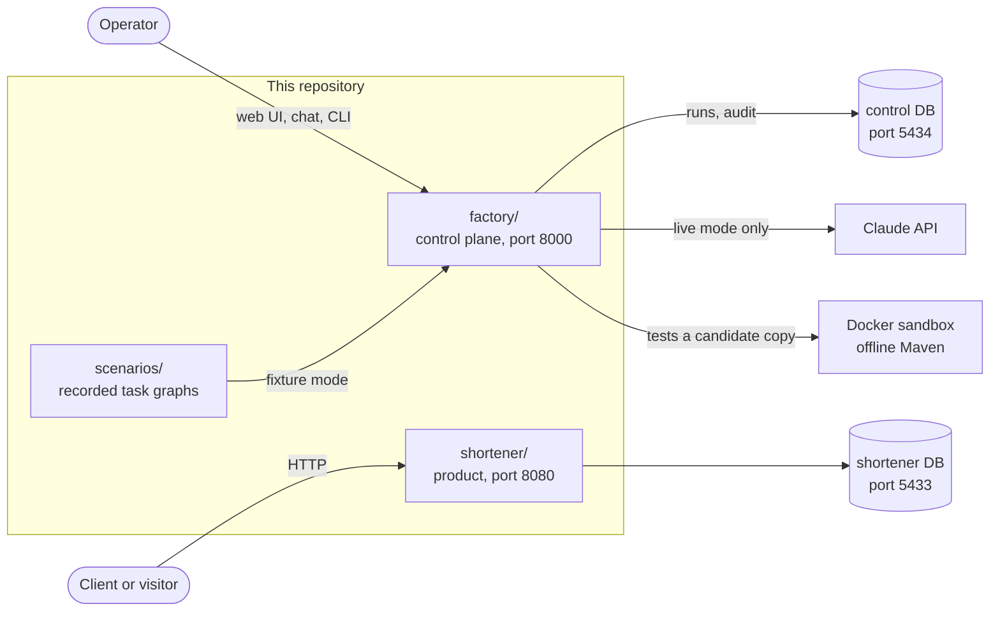

# Software factory and URL shortener

Two Spring Boot applications: a URL shortener and an agentic software factory that proposes, tests and presents changes for human approval. **Start here to run and evaluate the prototype locally.**

## 1. Setup and run locally

Run commands from the repository root. Use a full Git clone with tags, **JDK 21** (supported for the quality gate: 21–25), Maven 3.9+, Python 3 and Docker with Compose. Docker Desktop or Colima must be running. Ports **8000, 8080, 5433 and 5434** must be available. No API key is needed for fixture scenarios or automated tests; the first build and image pull need internet access.

```sh
# Check prerequisites; java and mvn must report JDK 21–25, not macOS's default JDK 17.
java -version
mvn -version
python3 --version
docker info

# Fetch scenario tags if your clone does not include them.
git fetch --tags

# Start both databases. Wait until both show "healthy" in the second command.
docker-compose up -d shortener-db control-db
docker-compose ps

# Build and unit-test both modules; warm the dependencies used by the offline sandbox.
mvn -q test

# Download the exact sandbox image used by local validation and CI.
docker pull maven@sha256:99e61abcff91a9b1333463bd8451fb18495d6eba9250ac66a338b518f8278320
```

If you used a shallow clone, first run `git fetch --unshallow --tags`. If your installation provides `docker compose` instead of `docker-compose`, use it in the commands above. On macOS with Homebrew JDK 21, select it with `export JAVA_HOME=/opt/homebrew/opt/openjdk@21` and `export PATH="$JAVA_HOME/bin:$PATH"` before Maven. Use your installed JDK path on other systems. A cold setup can take several minutes; do not interrupt the initial dependency download.

Start the applications in **two separate terminals**, keeping each process running:

```sh
# Terminal 1: product on port 8080
python3 scripts/shortener.py
```

```sh
# Terminal 2: factory on port 8000
python3 scripts/factory_web.py
```

In a third terminal:

```sh
curl -fsS http://localhost:8080/actuator/health/readiness
curl -fsS http://localhost:8000/actuator/health/readiness
python3 scripts/checks/acceptance.py
```

Both readiness endpoints should return `{"status":"UP"}` and acceptance should print `PASS`.

Create a real link and follow the returned `shortUrl` in your browser:

```sh
curl -i http://localhost:8080/api/shorten \
  -H 'Content-Type: application/json' \
  -d '{"url":"https://example.com"}'
```

Expected: `201` with `code` and `shortUrl`. A visit redirects with `302`; read counts at `GET /api/urls/{code}/analytics` after the one-second analytics flush.

Open **[the operator UI](http://localhost:8000/factory/)**. Under **Try a scenario**, select **Fixture demo**, choose **Ambiguous requirement**, then **Create scenario run** and **Start / resume**. Answer the clarification, review the proposed patch and validation evidence, then approve the exact proposal. The expected final state is `COMPLETED`; the candidate stays isolated under `.runs/`, without a merge or deployment. The greenfield and brownfield scenarios are available in the same dropdown.

[ADK chat](http://localhost:8000/dev-ui/?app=software_factory) provides project questions, diagrams and read-only commands such as `/help` and `/runs`. **Plain-language chat requires a live API key and incurs provider charges**; fixture workflows and read-only slash commands do not. Approvals belong in the operator UI.

## 2. Test and reproduce the evaluation

| Check | Command | Prerequisites / expected result |
| --- | --- | --- |
| Fast unit tests | `mvn test` | JDK, Maven, Git; no services or paid calls |
| Full quality gate | `mvn verify` | Unit tests, Spotless, PMD, SpotBugs/FindSecBugs, JaCoCo and platform checks must pass |
| Real integration tests | `mvn -Pintegration verify` | Both databases, Docker image and warm Maven cache; no running app required. REST Assured exercises real HTTP servers on random ports. |
| All six scenario replays | `python3 scripts/checks/agent_smoke.py` | Control database and sandbox; four complete, policy violation safe-stops, retry exhaustion fails as intended |
| Running product and operator APIs | `python3 scripts/checks/acceptance.py` and `python3 scripts/checks/web_smoke.py` | Both applications running; checks create test links and fixture runs |
| **Complete local evaluation with saved evidence** | **`python3 scripts/checks/evaluate.py`** | Both running applications and all prerequisites above; every check must pass |

The evaluator runs **`mvn -Pintegration clean verify`**, scenario replays, API checks, script tests and the historical evidence checksum check. It rejects missing/empty/skipped test suites and records the commit, source-file hashes, coverage, exit codes and logs in `.runs/evaluation/<timestamp>/results.json`. Do not edit source while it runs. Maven integration tests launch the current code; HTTP smoke checks exercise the processes you already started, so restart those after code changes. Automated approvals are explicitly labelled synthetic.

Optional real Chrome checks require Node 22.12+, Chrome and `puppeteer-core`:

```sh
# Install browser tooling outside the source tree.
npm install --prefix .runs/browser-tools puppeteer-core@25.0.4
export FACTORY_BROWSER_MODULE="$PWD/.runs/browser-tools/node_modules/puppeteer-core/lib/puppeteer/puppeteer-core.js"
# On Linux/Windows, also set CHROME_PATH to the installed Chrome executable.
python3 scripts/checks/evaluate.py --browser
```

This adds operator UI checks and ADK diagram/history regression tests with intercepted model responses. **None of these checks calls a paid model.** See [testing details](docs/04-quality/testing.md) and the [assignment review guide](docs/04-quality/assignment-readiness.md) for the requirement-to-evidence map and remaining limitations.

## 3. Optional live mode and shutdown

If `.env` does not exist, copy `.env.example` to `.env`. Do not overwrite an existing configuration. Put your Anthropic key in `ANTHROPIC_API_KEY` and generate a private audit key with `openssl rand -hex 32` for `FACTORY_AUDIT_KEY`; keep that key stable so existing audits remain verifiable. Never commit either key. Select a model available to your account with `CLAUDE_MODEL`. Restart the factory after changing configuration.

Live feature requests start from **committed `HEAD`**, pinned to an immutable SHA when the run is created. Commit intended product changes first; uncommitted changes are excluded. The factory pauses after requirement analysis for you to confirm scope and answer questions, then runs design/risk branches, planning, separately approved production and test patches, validation, documentation and final release review. There is no automatic merge or deployment. [Runbook](docs/03-operations/runbook.md) · [Operator guide](docs/03-operations/operator-guide.md).

Stop applications with **Ctrl-C** in their terminals. Stop the databases with `docker-compose down`; this retains data. Add `-v` only when you deliberately want to delete database volumes.

## Evidence and limits

- Fixtures execute real Git changes, sandboxed Maven tests, approvals and audit checks, but replay recorded agent text. They demonstrate orchestration, not model quality.
- Historical live evidence includes one completed bug-fix run. Greenfield/brownfield live attempts did not establish successful delivery; their original outcomes remain available in [recorded samples](docs/evaluation/samples/README.md).
- The design targets a single host/operator. It uses loopback access and operator tokens, bounded resources and separate databases. It is not an authenticated multi-tenant service; analytics are best effort and capacity has not been benchmarked.
- A high evaluation score requires defensible demonstrations, not a claimed percentage. The [assignment review guide](docs/04-quality/assignment-readiness.md) separates verified controls from the work still needed for a 95–100% target.

## How the pieces fit



*The factory never touches the running shortener or its database: it works on a Git worktree of the shortener's source.*

| Path | What it is |
| --- | --- |
| [`shortener/`](shortener/README.md) | The product. `POST /api/shorten`, `GET /{code}`, `GET /api/urls/{code}/analytics`. Contract in [`openapi.yaml`](shortener/openapi.yaml). |
| [`factory/`](factory/README.md) | The control plane: task graph, run engine, agents, sandbox validation, approvals, audit record, operator UI, chat and CLI. |
| [`scenarios/`](scenarios/README.md) | Six recorded scenarios (four that complete, two that must stop). |
| [`scripts/`](scripts/README.md) | Launchers and local checks. |
| [`docs/`](docs/README.md) | Overview, architecture, operations, quality and history, in reading order. |
| `build-config/` | PMD and SpotBugs rule files shared by both modules. |
| `.runs/`, `evidence/` | Created at run time and ignored by Git: candidate worktrees and immutable run outputs. |

## Where to go next

| If you want to | Read |
| --- | --- |
| Understand the idea and the vocabulary | [Overview](docs/01-overview/README.md), [glossary](docs/01-overview/glossary.md) |
| See how the factory works inside | [Factory architecture](docs/02-architecture/factory.md), then the [factory package guide](factory/README.md) |
| See how the shortener works inside | [Shortener architecture](docs/02-architecture/shortener.md), then the [shortener package guide](shortener/README.md) |
| Know why it was built this way | [Decision records](docs/02-architecture/decisions/README.md) |
| Run and operate it | [Runbook](docs/03-operations/runbook.md), [operator guide](docs/03-operations/operator-guide.md) |
| Judge the engineering quality | [Scorecard](docs/04-quality/scorecard.md), [security model](docs/04-quality/security.md), [risk register](docs/04-quality/risks.md) |
