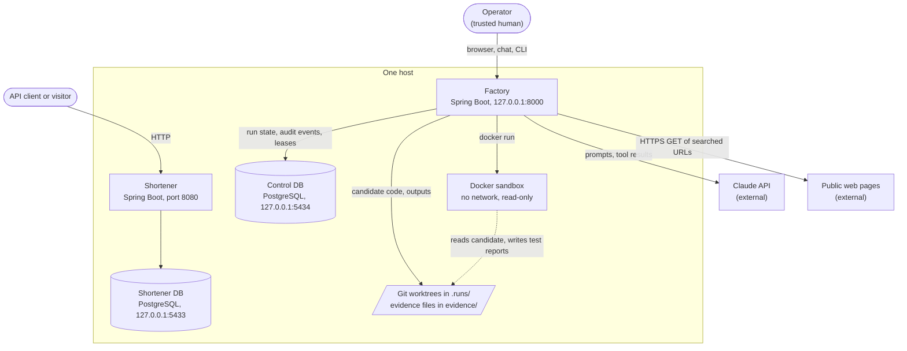
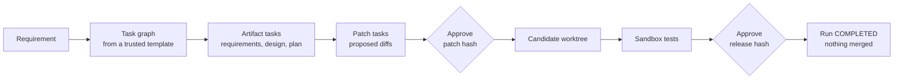

# Overview

**In one paragraph.** The factory is a supervised pipeline for changing software. An operator states a requirement. The factory turns it into a fixed graph of tasks, lets AI agents produce documents and patches for those tasks, applies the patches to an isolated copy of the code, proves the copy by running its tests in a sandbox, and waits for the operator to approve exact content at defined gates. Every state change is written to a tamper-evident record. The shortener is the product the factory works on, and a normal web service in its own right.

## The idea

A language model is useful for writing code and unreliable as an authority. So the system splits the two roles:

- **Agents propose.** An agent returns text: a document or a unified diff. It has read-only tools and nothing else.
- **Deterministic code decides.** Java code owns the task order, the path rules, patch application, test execution, budgets and the record of what happened.
- **A human approves.** Sensitive patches and every release wait for the operator, who approves a hash of exactly what was reviewed.

Nothing an agent writes can grant an approval, change the task graph, run a command on the host, or reach the control database.

## System context

*Everything runs on one machine; the only outbound connections are from the factory to the Claude API and to public web pages that a search returned.*

| Element | Role |
| --- | --- |
| Operator | Starts runs, answers questions, reviews and approves or rejects. Trusted. |
| Factory | The control plane. One process serves the operator page, the ADK chat UI and the JSON API. A separate short-lived process serves each CLI command. |
| Control DB | Run state, the audit chain, the chat budget and chat audit. Only the factory connects to it. |
| Claude API | Generates artifacts and patches in live mode, answers chat questions, and performs web search. Not used in fixture mode. |
| Docker sandbox | Runs the candidate's Maven tests offline. It holds no credentials and cannot reach the network. |
| Shortener | The product. It does not know the factory exists. |
| Shortener DB | Links and their redirect counters. |

## What a run looks like

*A requirement becomes documents, then patches, then a tested candidate; the operator decides at two kinds of gate.*

The terms in this diagram are defined in the [glossary](glossary.md). The mechanics are in [factory architecture](../02-architecture/factory.md).

## Two ways to generate

| Mode | Where task output comes from | Cost | Use it for |
| --- | --- | --- | --- |
| `fixture` | Files recorded next to the scenario in [`scenarios/`](../../scenarios/README.md) | None | Tests, demos, CI. Patches, sandbox tests, approvals and the audit record are all real. |
| `live` | Claude, called through Google ADK | Paid API calls, capped per run | Real feature requests. Needs `ANTHROPIC_API_KEY` and `FACTORY_AUDIT_KEY`. |

## What it deliberately is not

- Not a deployment tool. A completed run leaves a reviewed diff in a worktree; it does not merge, push or deploy.
- Not a multi-user service. There are no accounts or roles. The operator boundary is "a browser on this machine".
- Not a free-form planner. Task graphs come from trusted templates (`FeatureScenario` or a scenario file). The model cannot add, remove or reorder tasks.
- Not a guarantee of model quality. The record shows what was generated and tested; a human still judges whether it is good.

## Technology at a glance

| Concern | Choice |
| --- | --- |
| Language and runtime | Java 21 (builds on JDK 21 or newer) |
| Framework | Spring Boot 4.1.1: MVC, Security, JDBC, Flyway, Actuator, Micrometer |
| Agent runtime | Google ADK 1.10.1 with the Anthropic Java SDK 2.15.0 |
| Storage | PostgreSQL 16, one database per application |
| Isolation | Git worktrees for candidates; Docker for test execution |
| Build | Maven 3.9+, two independent modules under an aggregator POM |

The reasons behind these choices are in the [decision records](../02-architecture/decisions/README.md).
