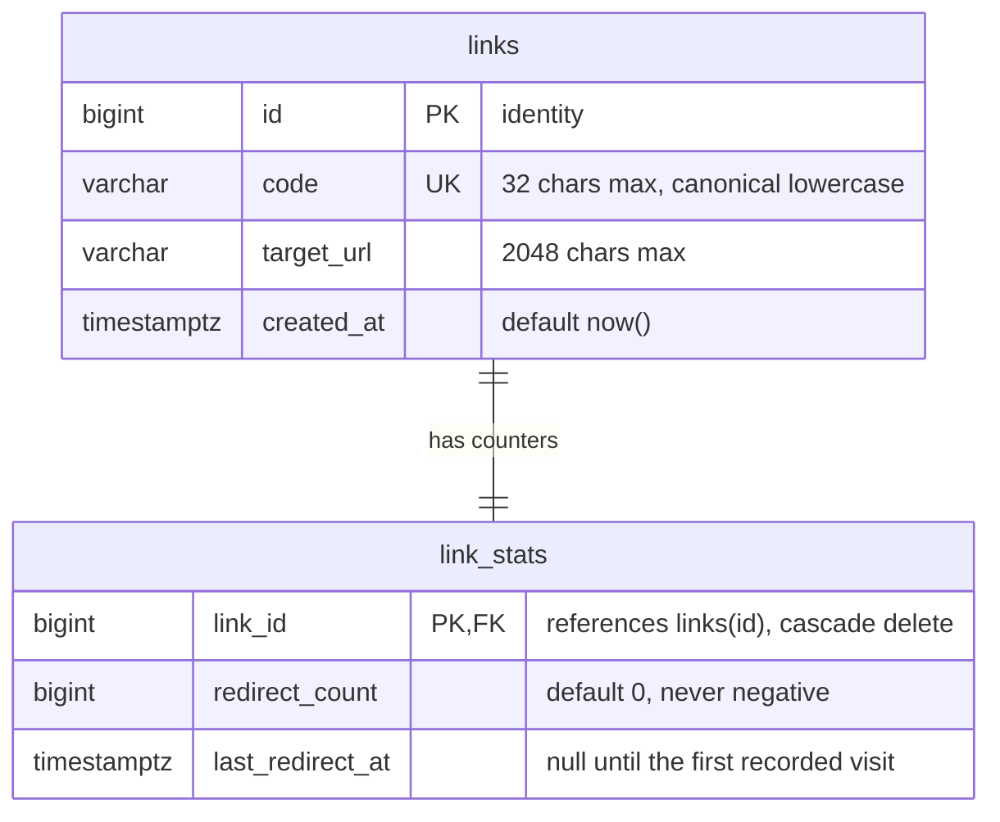
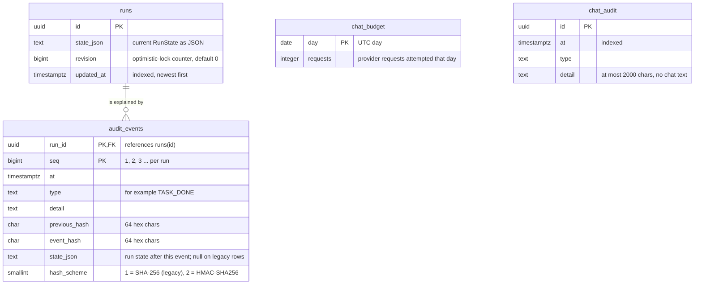
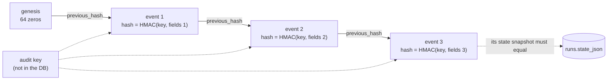

# Data model

**In one paragraph.** There are two PostgreSQL databases with nothing shared between them. The shortener database has two tables: links and their counters. The control database has four: the current state of every run, the append-only audit events that explain each state change, and two small tables for the chat budget and chat audit. Run outputs are files on disk, not rows; the database stores only their hashes. Both schemas are created and changed by Flyway migrations ([ADR 0005](decisions/0005-flyway-for-both-databases.md)).

## Where data lives

| Store | Location | Written by | Contents |
| --- | --- | --- | --- |
| Shortener DB | `localhost:5433`, database `shortener` | Shortener | Links, redirect counters |
| Control DB | `localhost:5434`, database `control` | Factory | Run state, audit events, chat budget, chat audit |
| Candidates | `.runs/<run-id>/` | Factory (Git) | One detached Git worktree per run |
| Feature requests | `.runs/requests/<uuid>.json` | Factory | The scenario generated for each feature request |
| Evidence | `evidence/<run-id>/` | Factory | Immutable task outputs, reviewed proposals, diagnostics |
| Development audit key | `.runs/audit.key` | Factory | Created only when `FACTORY_AUDIT_KEY` is not set |

`.runs/` and `evidence/` are ignored by Git.

## Shortener database

*Each link has exactly one counter row, created in the same statement as the link.*

| Rule | Enforced by |
| --- | --- |
| A code is unique | `UNIQUE` on `links.code`. This, not the application, decides concurrent claims for the same alias. |
| A code is canonical | `CHECK (code ~ '^[a-z0-9-]{4,32}$')` (`links_code_canonical`, migration V2) |
| A count is never negative | `CHECK (redirect_count >= 0)` (migration V2) |
| Counter updates stay cheap | `link_stats` has `fillfactor = 70`, leaving room for in-place (HOT) updates |

Migrations: [`V1__links.sql`](../../shortener/src/main/resources/db/migration/V1__links.sql), [`V2__link_constraints.sql`](../../shortener/src/main/resources/db/migration/V2__link_constraints.sql).

## Control database

*A run row is the latest snapshot; its audit events are the full history. The two chat tables are independent of runs.*

Migrations: [`V1__control_authority.sql`](../../factory/src/main/resources/db/migration/V1__control_authority.sql), [`V2__audit_scheme_and_indexes.sql`](../../factory/src/main/resources/db/migration/V2__audit_scheme_and_indexes.sql). V1 uses `IF NOT EXISTS` throughout and Flyway baselines at version 0, so a database created before Flyway was introduced is adopted without rewriting any stored state or audit bytes.

### The run state document

`runs.state_json` is the `RunState` class serialised as one JSON document. It is also what the operator API returns. The main fields:

| Field | Meaning |
| --- | --- |
| `id`, `scenario`, `mode`, `status` | Identity, scenario id, `fixture` or `live`, and the run status |
| `specPath`, `specHash`, `requirementHash` | The scenario file and the hashes pinned when the run started. A changed scenario pauses the run until it is revised. |
| `baselineTag`, `baselineCommit`, `candidatePath` | Where the candidate started and where it is |
| `tasks` | Status per task id |
| `artifactVersions`, `artifactHashes` | Current evidence version and its SHA-256 per task |
| `approvals` | Approved hash per task |
| `pendingApprovalTask`, `pendingApprovalHash`, `pendingClarificationTask`, `revisionRequiredTask` | What the run is waiting for |
| `validatedCandidateHash` | Hash of the candidate diff that last passed validation |
| `attempts`, `diagnosticVersions`, `patchDrafts`, `reviewFeedback` | Retry counts, diagnostic file versions, saved patch drafts, operator feedback per task |
| `modelCalls`, `maxModelCalls` | Budget used and its ceiling |
| `startedAt`, `finishedAt` | ISO-8601 instants |

The `audit` package stores this document as opaque text. Only the `run` package knows its shape.

### Evidence files

| File | Written when |
| --- | --- |
| `<task>-v<N>.txt` | A task output, or a snapshot of exactly what the operator is asked to approve. `N` grows with each version. |
| `<task>-proposal-v<N>.txt` | A generated patch exactly as the agent returned it, before any rule judged it. |
| `<task>-error-v<N>.txt` | The diagnostic of a failed attempt. |

`EvidenceStore` publishes a file with an atomic create that never replaces. Writing the same content again is accepted; different content under an existing name is an error.

## The audit hash chain

*Each event's hash covers the hash before it, so changing or removing an old event invalidates every later one.*

The hashed fields of an event are: the previous hash, the sequence number, the timestamp, the type, the detail and the full state snapshot. Under scheme 2 each field is length-prefixed before hashing, so two different field splits can never produce the same input.

Verification (`AuditTrail.verify`, used before every advance, approval and release, and by the CLI command `verify-audit`) reads the whole chain in one repeatable-read transaction and checks that:

1. sequence numbers are 1, 2, 3 and so on with no gap,
2. every `previous_hash` equals the recomputed hash of the event before it,
3. every `event_hash` equals the recomputed hash of its own fields,
4. the scheme never goes from 2 back to 1,
5. the state snapshot of the newest event equals `runs.state_json`.

What this does and does not prove is discussed in [ADR 0007](decisions/0007-hmac-audit-chain-with-versioned-schemes.md) and the [security model](../04-quality/security.md).

## Concurrency rules

| Rule | Mechanism |
| --- | --- |
| One process changes a run at a time | `pg_try_advisory_lock(0x46414354, hash(run id))` held on a dedicated connection for the transition (`RunLeases`). No waiting: the second caller gets a conflict. |
| A stale writer cannot overwrite | `SELECT revision ... FOR UPDATE`, compare with the revision the writer loaded, then update (`RunJournal.record`) |
| State and its explanation never diverge | The audit event insert and the run update are one transaction |
| The chat budget cannot be overspent by a race | A single `INSERT ... ON CONFLICT DO UPDATE ... WHERE requests < limit RETURNING` (`ChatLedger`) |
| Two requests cannot both claim an alias | The unique constraint on `links.code` |
| Concurrent analytics flushes cannot deadlock | Batches update rows in link-id order |

## Retention

Nothing is deleted automatically. `python3 scripts/factory_cli.py prune` removes the worktree and evidence folder of finished runs older than a cut-off; database rows and the audit chain are always kept. See the [runbook](../03-operations/runbook.md#prune-old-runs).
