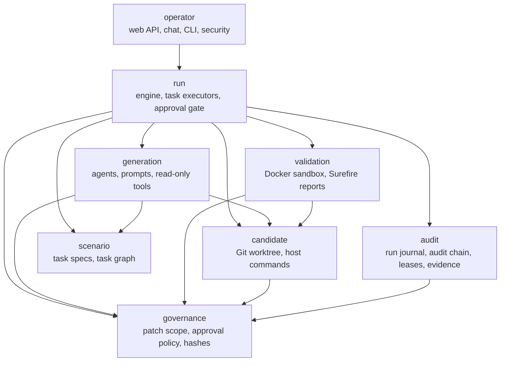
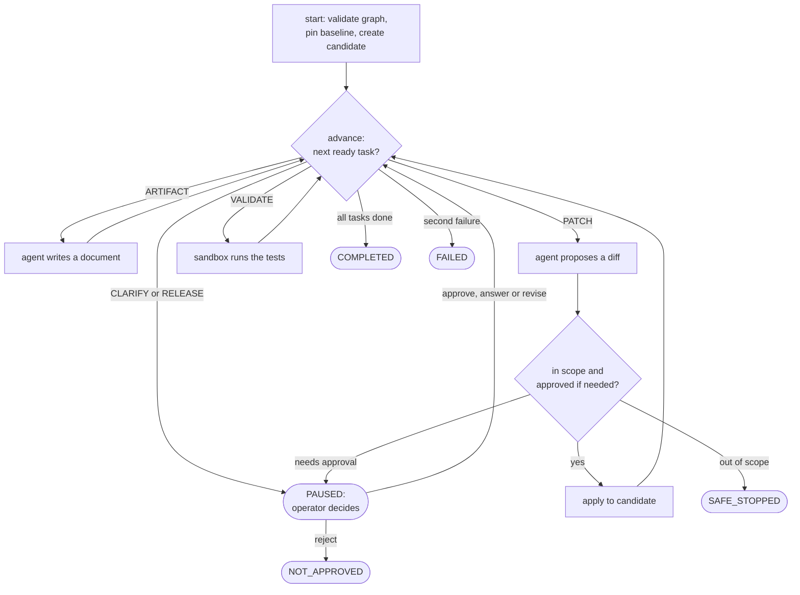
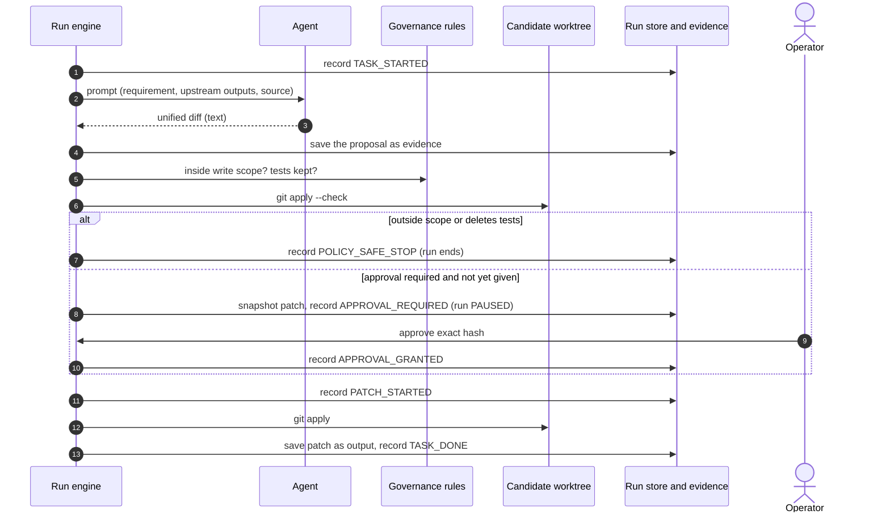
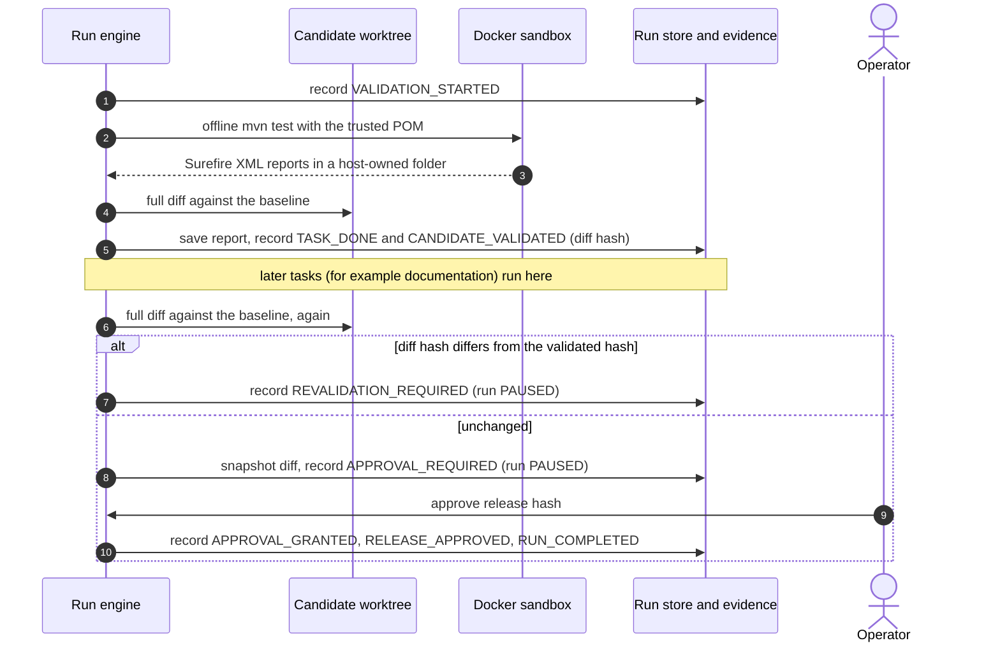
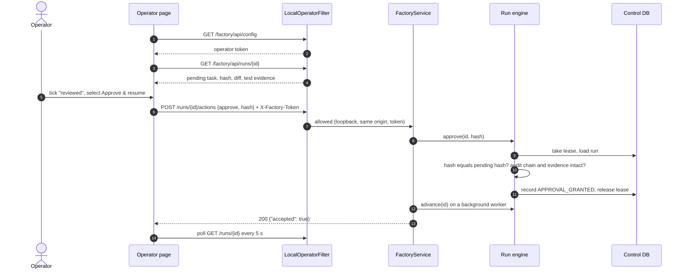
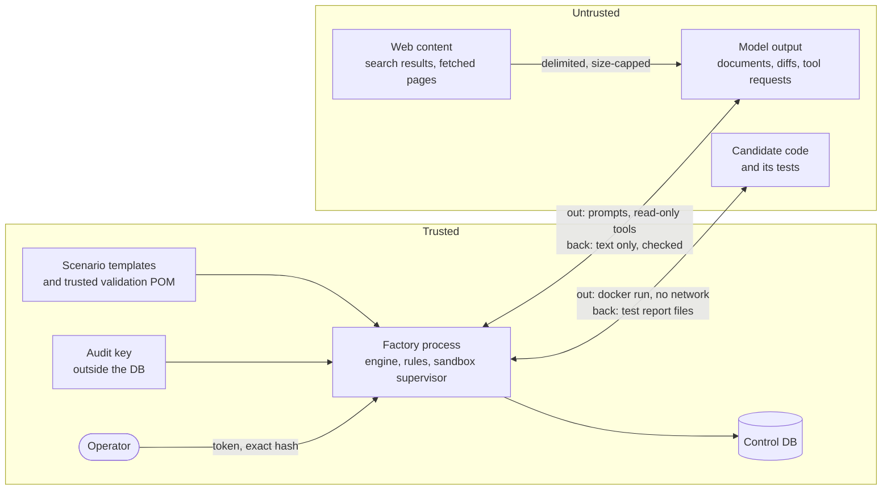

# Factory architecture

**In one paragraph.** The factory is one Java process built around `RunEngine`. The engine walks a validated task graph and executes one task at a time (or two documents in parallel). Each step ends with a single database transaction that stores the new run state together with the audit event that explains it. Agents only return text. Patches are checked against path rules, applied to a Git worktree, and tested in an offline Docker container. The run pauses whenever a human decision is needed and resumes only for the exact content that was approved.

Words such as *run*, *task*, *candidate*, *evidence* and *lease* are defined in the [glossary](../01-overview/glossary.md). The class-by-class guide is in [`factory/README.md`](../../factory/README.md).

## Components

*Packages under `dev.softwarefactory`; an arrow means "may depend on". `platform` (settings, JSON, shared exceptions) is used by all and omitted. `operator` may also use every package below `run`.*

The direction is enforced. `StoryArchitectureTest` (ArchUnit) fails the build if a package reaches upward or forms a cycle. See [ADR 0012](decisions/0012-story-packages-enforced-by-archunit.md).

| Package | Responsibility |
| --- | --- |
| `scenario` | What is asked: `ScenarioSpec`, `TaskSpec`, `TaskGraph`, and `FeatureScenario`, the fixed workflow for feature requests. |
| `run` | How a run progresses: `RunEngine` and its transitions (`StartRun`, `AdvanceRun`, `ApproveStep`, `AnswerClarification`, `ReviseRun`, `RecoverInterruptedRun`), one executor per task kind, `FailureHandling`. |
| `generation` | How task output is produced: `FixtureRuntime` (recorded) or `AdkClaudeRuntime` (live), `PromptBuilder`, and the read-only tools in `generation/tools`. |
| `candidate` | The isolated working copy: `GitWorkspace`, and `CommandRunner` for bounded host processes. |
| `validation` | Proving the candidate: `SandboxValidator`, `DockerSandbox`, `SurefireReports`, `GeneratedTestPolicy`. |
| `governance` | Rules: `PatchScope`, `PatchPolicy`, `Hashes`. |
| `audit` | The record: `RunJournal`, `AuditTrail`, `AuditChain`, `RunLeases`, `EvidenceStore`, `ChatLedger`, `RunMetrics`. |
| `operator` | How humans drive it: `api` (HTTP), `chat` (ADK agent and slash commands), `cli`, `security` (local boundary), `web` (Spring composition root). |

### Processes

| Process | Started by | What it owns |
| --- | --- | --- |
| Web server | `scripts/factory_web.py` (`FactoryWebServer`) | Operator page, ADK chat UI, JSON API, up to two background workers that advance runs. Uses a Hikari pool of 8 connections. |
| CLI | `scripts/factory_cli.py <command>` (`FactoryCli`) | One command, then exit. Connects directly, applies the same Flyway migrations, uses the same engine. |

Both can run at the same time against the same control database. The per-run lease keeps them from changing one run concurrently.

## Run lifecycle

*The short version of a run: tasks execute in dependency order until the run finishes or needs a person.*

The complete flowchart, the `RunStatus` and `TaskStatus` state diagrams, and the table that classifies failures are in [`factory/README.md`](../../factory/README.md#the-story-of-a-run). They are kept next to the code they describe.

### What "ready" means

A task is ready when it is `PENDING` and every task it depends on is `DONE`. `AdvanceRun` asks `TaskGraph.ready(...)` for the list after every step. If at least two ready tasks are `ARTIFACT` tasks that need no approval, the first two run concurrently and are joined (`ParallelBranches`). Otherwise the first ready task runs alone.

### One transition, one transaction

Every state change goes through `RunStore.record(state, eventType, detail)`. In production (`DurableRunStore` and `RunJournal`) that is one transaction which:

1. locks the run row and checks that the caller loaded the latest revision,
2. appends the audit event, hashed over the previous event and the new state,
3. replaces the stored state and increments the revision.

The whole transition also holds the run's lease. A process that loses a race gets `409 Conflict` ("Run is already being advanced" or "Stale run revision") and changes nothing. See [ADR 0006](decisions/0006-advisory-lock-run-leases.md) and [ADR 0007](decisions/0007-hmac-audit-chain-with-versioned-schemes.md).

## A patch task, step by step

*A patch is saved before it is judged, judged before it is shown, and applied only after any required approval.*

Details worth knowing:

- **Scope check** (`PatchScope`): every changed path must be a plain file under one of the task's write-scope prefixes. Symlinks, submodules, renames, copies, `..`, `.git*` (except `.gitignore`), `target/`, `.env*` and `*.log` are refused. A violation is a `PolicyViolationException`, which safe-stops the run.
- **Test policy** (`GeneratedTestPolicy`): a patch may not delete a test class or tag a test `integration` to hide it from the default run.
- **Approval policy** (`PatchPolicy`): approval is required if the task says so, or if the patch touches build files, Compose or Docker files, `.github/`, migrations, `src/main/resources/`, application configuration, anything under `platform/` or `bootstrap/`, files with `Security` in the name, or the factory itself. In the built-in feature workflow both patch tasks always require approval.
- **Apply** (`GitWorkspace.apply`): the paths Git reports for the patch must equal the paths in the reviewed diff headers, then `git apply --whitespace=error` runs. Applying a patch clears the validated-candidate hash, so a release cannot pass on stale test results.
- **After approval the patch is not generated again.** The engine re-reads the saved draft, re-checks it, and applies those exact bytes.

## From patch to release

*Release approval covers the exact diff that was tested; any change in between sends the run back.*

Validation passes only if Maven exits 0, at least one test ran, there are no failures, errors or skips, and every test class changed by an upstream patch produced a report with at least one executed test. A `VALIDATE_RED` task is the opposite check for bug fixes: exactly one named test class must fail by assertion on the still-buggy candidate. See [ADR 0009](decisions/0009-trusted-validation-pom-and-offline-sandbox.md) and [ADR 0008](decisions/0008-forced-private-index-release-diff.md).

## An approval through the web page

*The page sends back the hash it displayed; the engine accepts it only if it still matches the pending proposal and the record is intact.*

Refusals: a hash that does not match returns `409` and changes nothing. If the stored proposal no longer hashes to the reviewed value, or a release diff no longer equals the candidate, the run is safe-stopped. If two other runs are already being advanced the request returns `503` before any decision is recorded.

## Failures, retries and recovery

`FailureHandling` turns every task failure into one of four outcomes:

| Cause | Outcome |
| --- | --- |
| A rule was broken (`SecurityException`) | Run `SAFE_STOPPED`. Never retried. |
| The platform failed: Docker, the validator image, the Maven cache, the control database (`InfrastructureException`) | Run `PAUSED`, task back to `PENDING`. The retry budget is untouched. |
| A validation failed reproducibly (`ValidationFailedException`) | Run `PAUSED` with `revisionRequiredTask` set. An upstream task must be revised. |
| Anything else | First time: run `PAUSED`, retry offered. Second time: run `FAILED`. |

Recovery after a crash happens at the start of the next advance (`RecoverInterruptedRun`). A task found `RUNNING` adopts its output if the evidence file was already written, so a finished model call is not paid for twice. Otherwise it is queued again. If the interrupted task was a patch, the candidate is reset to its baseline, completed patches are re-applied in order, and everything downstream of the interrupted patch is queued again, including validation.

Before every advance and every release the engine verifies the audit chain and the hash of every completed output (`EvidenceIntegrity`). A mismatch safe-stops the run.

## Live generation

In live mode `AdkClaudeRuntime` builds one ADK agent per task invocation, with `ThinkingAwareClaude` as the model adapter ([ADR 0011](decisions/0011-custom-thinking-aware-claude-adapter.md)).

| Limit | Value | Where |
| --- | --- | --- |
| Provider requests per run | 24 by default, at most 100 (`FACTORY_MAX_MODEL_CALLS`) | `RunState.maxModelCalls`, reserved and audited before each request |
| Provider requests per task invocation | 8 | `ToolSession.MAX_MODEL_REQUESTS` |
| Tool calls per task invocation | 12 | `ToolSession.MAX_TOOL_CALLS` |
| Deadline per task invocation | 900 s by default (`FACTORY_RUN_DEADLINE_SECONDS`) | `FactorySettings` |
| Timeout per provider request | 5 minutes, never past the deadline | `ToolSession.MAX_REQUEST_TIMEOUT` |
| Output tokens per response | 32,768; a longer response is an error, not a truncation | `ThinkingAwareClaude` |
| SDK retries | 0 | `ModelClients` |

The prompt contains the requirement, the task instruction, any operator feedback, the previous failure diagnostic, the outputs of upstream tasks, and a bounded copy of the shortener source from the candidate (16,000 bytes per file, 80,000 bytes in total). Everything except the instruction is wrapped in random delimiters and labelled as data. The tools are described in [agent tools](../03-operations/agent-tools.md).

## Trust boundaries

*Untrusted input enters the factory only as text or as test reports, and each entry point has a named check.*

| Boundary | What crosses it | Control |
| --- | --- | --- |
| Model to engine | Documents, diffs, tool calls | Diffs are inert until `PatchScope`, `GeneratedTestPolicy`, `PatchPolicy` and `git apply --check` pass. There is no tool that writes, executes or approves. |
| Web to model | Search summaries, page text | Pages can be fetched only if a search returned that URL. Results are size-capped and delimited as data. |
| Candidate to engine | Test results | Code runs only inside the sandbox. Results are read from report files in a folder the candidate cannot write to before the run, not from process output. |
| Browser to engine | Operator actions | Loopback host name, same origin, `X-Factory-Token`, 64 KiB body limit, strict Content-Security-Policy. |
| Engine to control DB | State and audit events | Separate database and credentials that no agent or sandbox receives. |

Threats, controls and what remains exposed are listed in the [security model](../04-quality/security.md).

## Known limits

- One host. Leases and revisions make concurrent processes safe, but there is no scheduler across machines.
- At most two runs advance at once in the web process (`RunWorkers`), and at most two documents are generated in parallel within a run.
- Task graphs are fixed templates. The model cannot change the plan.
- Validation is tied to the shortener: the trusted POM builds `shortener/` with the current dependency set.
- The model-call budget counts requests, not tokens or money.
