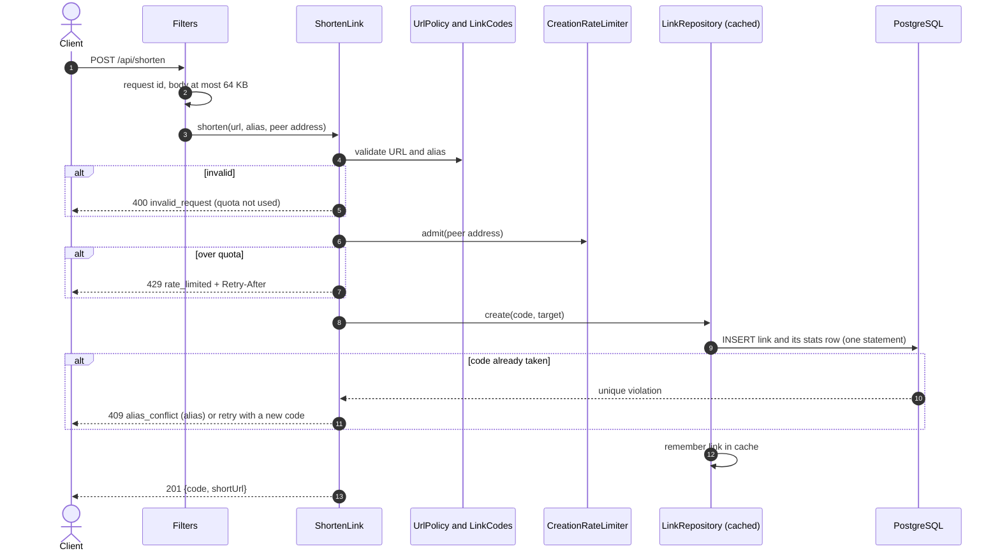
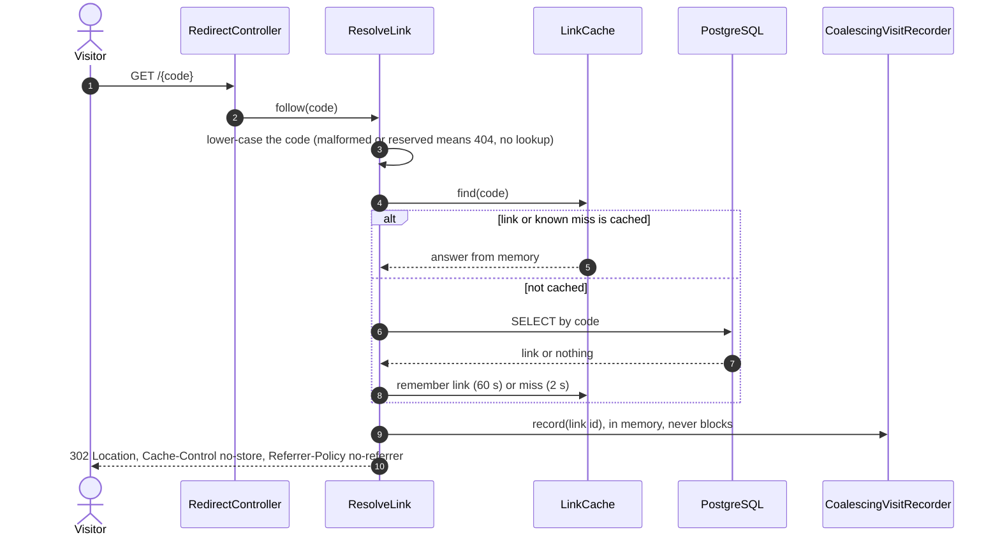
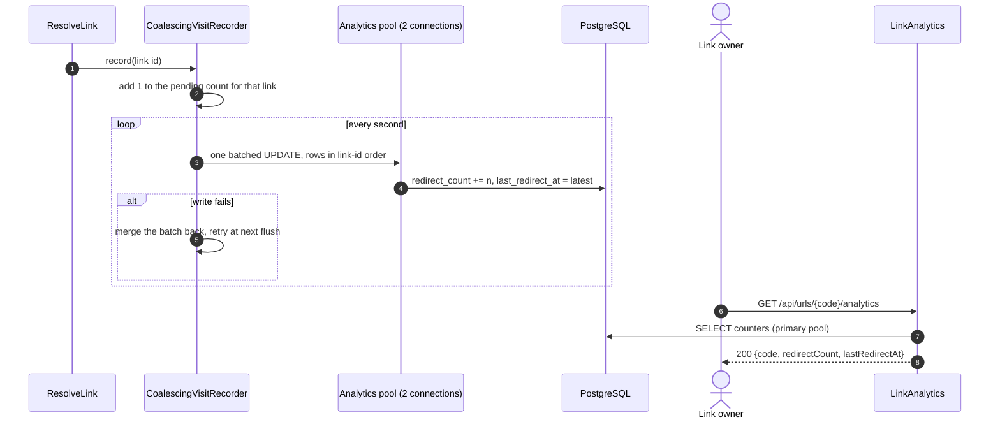

# Shortener architecture

**In one paragraph.** The shortener is a stateless Spring Boot service in front of PostgreSQL. It has three use cases, one package each: create a link (`shorten`), follow a link (`redirect`), and read how often it was followed (`analytics`). Links never change after creation, which is what makes the rest simple: lookups are cached in memory, redirects keep working for cached links when the database is briefly down, and visit counts are added up in memory and written in batches so that a redirect never waits for a counter.

The public contract is [`shortener/openapi.yaml`](../../shortener/openapi.yaml). The package map and conventions are in [`shortener/README.md`](../../shortener/README.md). The tables are in the [data model](data-model.md#shortener-database).

## Endpoints

| Request | Success | Purpose |
| --- | --- | --- |
| `POST /api/shorten` with `{"url": "...", "alias": "optional"}` | `201` with `code` and `shortUrl` | Create a link. |
| `GET /{code}` | `302` with `Location` | Redirect and count the visit. |
| `HEAD /{code}` | `302` with `Location` | Preview the target. Not counted. |
| `GET /api/urls/{code}/analytics` | `200` with `redirectCount` and `lastRedirectAt` | Read the counters. |
| `GET /actuator/health`, `/actuator/health/liveness`, `/actuator/health/readiness`, `/actuator/info` | `200` | Health. Every other `/actuator/**` path is denied. |

Every error is an RFC 9457 problem document with a stable `error` code. Every response carries `X-Request-Id`.

## Create a link

*Validation comes first and has no side effects, so only valid requests use up quota; the database's unique constraint decides races.*

- **URL rules** (`UrlPolicy`): absolute `http` or `https`, no credentials, at most 2048 bytes. Rejected hosts: single-label names, local names (`localhost`, `local`, `internal`, `intranet`, `lan`, `home.arpa`), the shortener's own host, non-public IPv4 and IPv6 literals, and any numeric-looking host that is not plain dotted decimal. The check is on the text only. The service never resolves DNS and never fetches the target.
- **Quota** (`CreationRateLimiter`): 30 requests per 60-second fixed window per client. The client is the socket peer: an IPv4 address or an IPv6 /64. When 10,000 clients are tracked, expired windows are swept, and new clients then share a coarser /16 or /48 bucket instead of being refused.
- **Codes** (`CodeGenerator`): 8 characters from `0-9a-z` drawn with `SecureRandom`. A collision or a reserved word is retried, at most four times.

## Follow a link

*A redirect needs at most one indexed read and never waits for a write.*

- **Cache** (`LinkCache`, Caffeine): up to 10,000 links for 60 seconds, and separately up to 2,000 known-missing codes for 2 seconds. Misses have their own cache so that scanning unknown codes cannot push real links out.
- **Database down:** a cached link still redirects. An uncached code answers `503 temporarily_unavailable` with `Retry-After: 5`.
- **`HEAD`** takes the same path but calls `resolve`, which skips the recorder.
- Redirects are never rate limited. `RedirectRateLimitRegressionTest` guards that.

## Count and read visits

*Visits are added up in memory and written once per second per link, on a pool that redirects do not share.*

- **Bound:** at most 10,000 links may have pending counts. Visits beyond that are dropped and counted in `shortener.analytics.dropped{reason="overflow"}`.
- **Failure:** a failed flush is merged back within the same bound. What does not fit is counted in `shortener.analytics.dropped{reason="flush_failed"}`.
- **Shutdown:** the recorder stops after the web server has drained and flushes once more, so a clean stop loses nothing.
- **Consequence:** counts lag by about one second and are best effort. They are not suitable for billing.

See [ADR 0003](decisions/0003-coalesced-analytics-writes.md) and [ADR 0004](decisions/0004-two-hikari-connection-pools.md).

## Cross-cutting behaviour

| Concern | Behaviour | Class |
| --- | --- | --- |
| Request id | `X-Request-Id` is echoed if it matches `[A-Za-z0-9._:-]{1,64}`, otherwise a UUID is generated. It is in every log line. | `platform/http/RequestCorrelation` |
| Body limit | Bodies over 64 KB on `/api/*` are refused with `413` before JSON parsing, including chunked bodies. | `platform/http/RequestBodyLimit` |
| Errors | Use cases throw an `ApiException` subclass that names its status. One handler turns everything into a problem document. Database timeouts and connection failures become `503`; other database errors become `500`. | `platform/http/ApiErrors` |
| Security | Public endpoints carry no credentials and bypass the Spring Security chain. The chain guards `/actuator/**` only: health and info are public, the rest is denied. | `platform/security/PublicApiSecurity` |
| Timeouts | Connection wait 1 s, statement timeout 2 s, lock timeout 1 s, socket timeout 5 s. A stuck database produces a fast `503`, not a queue of threads. | `application.yml` |
| Shutdown | Graceful: in-flight requests finish, then the recorder flushes, then the pools close. | `application.yml`, `CoalescingVisitRecorder` |
| Settings | All tunables are in one validated record and fail at startup if invalid. | `platform/ShortenerProperties` |

## Known limits

- The cache and the rate limiter are per process. Running more than one instance multiplies the effective quota and makes cache contents differ between instances. See [ADR 0002](decisions/0002-hand-rolled-rate-limiter-and-caffeine-cache.md).
- The client address is the socket peer. Behind a reverse proxy every request appears to come from the proxy unless `SHORTENER_FORWARD_HEADERS_STRATEGY` is set and the proxy overwrites `X-Forwarded-For`.
- Links cannot be edited, expired or deleted.
- A public-looking DNS name that resolves to a private address is accepted. The service only redirects browsers and never connects to targets itself, so the exposure is redirect abuse, not server-side request forgery.
- No load test has been recorded. There are no throughput or latency numbers to quote.
