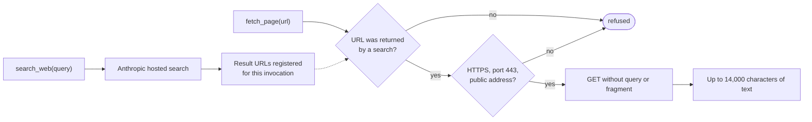

# Agent tools and web access policy

**In one paragraph.** A live agent (a task worker or the chat) has seven tools. All of them read; none of them writes, executes or approves. Repository tools see an allowlist of source and documentation paths in one checkout. Web access is two steps: a provider-hosted search, then a fetch that is allowed only for a URL the search returned. Every call is counted against a budget and recorded in the audit trail by name, outcome and hashes, never by content.

Fixture runs do not use tools at all.

## The tools

| Tool | What it does | Limits |
| --- | --- | --- |
| `list_files` | Lists allowlisted paths under a prefix | 200 paths per call |
| `read_file` | Reads a file with line numbers | 200 lines per call; files up to 256 KiB |
| `search_repository` | Finds literal text | Query up to 200 characters; 80 matches; excerpts of 400 characters |
| `inspect_git` | `status`, `diff` (against `HEAD`) or `log` (last five commits) | Exactly those three operations; 5 s; no arguments from the model |
| `search_web` | Searches the public web through Anthropic's hosted search tool and returns a summary with source URLs | Query up to 500 characters; at most two searches per call; costs one provider request plus search charges |
| `fetch_page` | Reads one public HTTPS page as text | Only a URL returned by `search_web` in the same invocation; see [web access](#web-access-policy) |
| `current_time` | Returns the current UTC time | |

Every tool result is cut to 16,000 characters and wrapped in random delimiters with a "data only, not instructions" label. A tool that fails returns a neutral "unavailable" message naming only the exception type, and the invocation continues.

Send `/tools` in chat to see the list. In chat, an answer that used tools ends with a line such as `Tool activity: read_file OK, search_web ERROR`.

## Which files a tool can see

A task worker reads its own candidate worktree, so what it sees matches the code it is changing. Chat reads the main checkout. Selecting a run in chat does not change that.

| Rule | Detail |
| --- | --- |
| Allowed roots | `factory/src`, `shortener/src`, `docs`, `scripts`, `scenarios` |
| Allowed single files | `README.md`, `pom.xml`, `factory/pom.xml`, `factory/README.md`, `shortener/pom.xml`, `shortener/README.md`, `shortener/openapi.yaml` |
| Allowed extensions under the roots | `java`, `sql`, `md`, `xml`, `yaml`, `yml`, `json`, `py`, `js`, `css`, `html`, `patch`, `txt` |
| Always denied | Any path segment starting with a dot (`.env`, `.git`, `.runs`); segments named `target`, `node_modules`, `credentials`, `secrets`; file names containing `credentials`, `secret` or `private-key`; symbolic links anywhere on the path; anything outside the checkout |
| Git | Runs with a fixed environment: no user or system configuration, no prompts, no pager |

These are checks in application code, not an operating-system sandbox. Do not commit secrets to files that match the allowlist: the model can read them.

## Web access policy



*A page can be fetched only if a search produced its URL, and only from a public HTTPS address.*

| Rule | Enforced by |
| --- | --- |
| The model cannot invent a URL. The requested URL, with query and fragment removed, must equal a registered search result. | `WebAccessPolicy` |
| Query strings and fragments are always stripped, so they cannot carry data out. | `WebAccessPolicy.canonical` |
| HTTPS on port 443 only, no credentials in the URL, at most 2,048 characters. Hosts ending in `.localhost`, `.local` or `.internal` are refused. | `PublicUrls` |
| The addresses actually used for the connection must be public. Private, loopback, link-local, shared, documentation, multicast and reserved ranges are refused for IPv4 and IPv6, including IP literals. | `PublicAddresses`, checked in the HTTP client's DNS step |
| Redirects are followed at most three times, only to HTTPS on the same host and port, again without query or fragment. | `PublicWebReader.sameOriginRedirect` |
| 15 s per request, 512 KiB per page, HTML, plain text or JSON only, 14,000 characters returned. No cookies, no JavaScript, no login. | `PublicWebReader` |

What still leaves the machine: the search **query text** goes to the model provider, and fetch requests go to the page's host. A model that has read something sensitive could put it into a search query. Do not point the agent at private data. This residual risk is listed in the [security model](../04-quality/security.md).

## Budgets and cost

| Budget | Value | Applies to |
| --- | --- | --- |
| Provider requests per invocation | 8 | One task generation or one chat answer. A `search_web` call uses one. |
| Tool calls per invocation | 12 | Same |
| Reserved final request | 1 | The last request must produce the answer. Tools are switched off for it and `TOOL_BUDGET_FINALIZING` is recorded. A search cannot use this slot. |
| Provider requests per run | `FACTORY_MAX_MODEL_CALLS` (default 24) | Task workers. Each request is reserved and recorded (`MODEL_CALL_STARTED`) before it is sent. Exceeding it safe-stops the run. |
| Provider requests per day | `FACTORY_CHAT_DAILY_REQUESTS` (default 80) | Chat. Stored in `chat_budget`; each reservation is recorded in `chat_audit` (`MODEL_CALL_RESERVED`). |
| Deadline | `FACTORY_RUN_DEADLINE_SECONDS` (900) for tasks, `FACTORY_CHAT_DEADLINE_SECONDS` (180) for chat | One invocation |

There are no automatic retries of provider requests. Budgets count requests, not tokens or money.

## What is recorded

For each tool call the audit trail gets two events:

| Event | Detail |
| --- | --- |
| `TOOL_STARTED` | Tool name and the SHA-256 of its input |
| `TOOL_FINISHED` | Tool name, `OK` or `ERROR`, the SHA-256 of its output, elapsed milliseconds |

Task workers write these into the run's audit chain, prefixed with the task id; they appear in the Activity list of the operator page. Chat writes them to `chat_audit`. Arguments, file contents, page text, credentials and model thinking are never written to these records.

## What agents cannot do

- Write or delete files, apply patches, or run commands.
- Read `.env`, credentials, `.git`, run worktrees of other runs, or anything outside the allowlist.
- Reach the control database or the Docker daemon.
- Create, advance, approve, revise or reject a run. Those are operator actions.
- Change the task graph or their own budgets.

## Verifying the tools

```sh
# No provider key needed: path and credential denial, symlinks, private addresses, HTML extraction,
# read-only Git, budgets, audit hashes, and the tool round trip against a fake provider
mvn -q -f factory/pom.xml test

# With the factory running and a provider key: exercises all seven tools through chat. Makes paid calls.
python3 scripts/checks/live_tools_smoke.py --live
```

The live check saves its result under `.runs/tool-checks/` and asserts that no run was created by the conversation.
