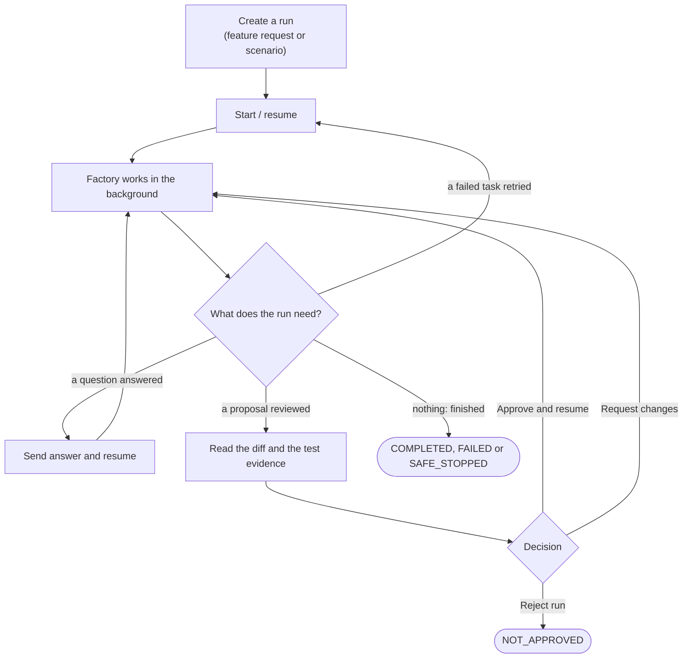
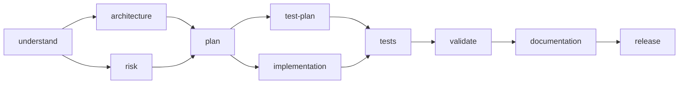

# Operator guide

**In one paragraph.** You drive the factory through three surfaces that share one engine and one database: the operator page (the normal place to work and the only place to approve from a browser), the ADK chat (questions and read-only commands), and the CLI (scripts and recovery). A run only moves when you tell it to, pauses whenever it needs you, and accepts an approval only for the exact content you were shown.

Start the factory first: see the [runbook](runbook.md#start).

| Surface | Address | Good for |
| --- | --- | --- |
| Operator page | <http://localhost:8000/factory/> | Creating runs, watching progress, reading artifacts, approving, requesting changes, rejecting |
| ADK chat | <http://localhost:8000/dev-ui/?app=software_factory> | Asking about the project, listing and inspecting runs |
| CLI | `python3 scripts/factory_cli.py <command>` | Automation, audit verification, pruning, working without the web server |

## The approval flow



*You are asked for one of three things: an answer, a decision on a proposal, or permission to retry.*

What each decision does:

| Decision | Effect |
| --- | --- |
| **Approve & resume** | Records approval of the displayed hash and continues. Refused if the proposal, its inputs or the candidate changed since it was displayed. |
| **Request changes & resume** | Sends one task back with your feedback. That task and everything after it are generated again; their patches are removed from the candidate. The model-call budget is not reset. The feedback is included in the next prompt. |
| **Reject run** | Ends the run as `NOT_APPROVED`. This cannot be undone. |

There are two kinds of proposal:

- **A patch**, before it is applied. In a feature request both the implementation patch and the test patch stop here.
- **A release**, at the end: the complete candidate diff against its baseline, shown beside the validation report.

Approving the release marks the run `COMPLETED`. It does not merge, push or deploy. The result stays in `.runs/<run-id>/`.

## Operator page

### Create a run

- **New feature:** describe the feature (up to 8,000 characters) and select **Create request**. This saves a live run that starts from committed `HEAD`, pinned to its exact SHA at creation. Nothing is generated and nothing is charged until you select **Start / resume**. The page asks for confirmation before creating a live run and before resuming one.
- **Try a scenario:** choose one of the four recorded scenarios and an execution mode. **Fixture demo** makes no model calls. **Live model** runs the same task graph with paid calls.

Live runs need `ANTHROPIC_API_KEY` and `FACTORY_AUDIT_KEY`; the page says which is missing.

The feature workflow is fixed:



*The ten tasks of a feature request. `implementation` and `tests` are patches that need approval; `release` is the final approval.*

`implementation` may only change `shortener/src/main` and `shortener/openapi.yaml`. `tests` may only change `shortener/src/test`.

New feature requests use the current committed product. Uncommitted edits are excluded; commit intended product changes before creating a request. The run pins its baseline SHA, so later commits cannot change its candidate. Historical scenario replays continue using their own baseline tags.

After requirements generation, feature requests pause for scope confirmation. Review the requirements artifact, answer open questions and confirm or correct the acceptance criteria before design proceeds. Architecture and risk branches receive both the requirements and your recorded answer.

### Watch a run

| Section | Shows |
| --- | --- |
| Recent runs | The 100 most recently updated runs |
| Workflow dependencies | Each task, its status and what it waits for |
| Run reliability | Elapsed time, retries, rollbacks, replans, recovery time ([definitions](../04-quality/scorecard.md#reliability-metrics)) |
| Artifacts & test evidence | Every stored output; select one to read it |
| Activity | The latest 200 audit events, and whether the audit chain verifies |
| Human decision | The question or proposal waiting for you |

The page refreshes every 5 seconds while a worker is active and every 15 seconds otherwise. A hidden tab stops refreshing. The audit verification shown on the page is cached for up to 30 seconds and is for display only: every engine action runs its own fresh check.

### Review a proposal

1. Read **Proposed diff**. It is the stored text the hash was computed from.
2. Read **Validation evidence** when it exists. For a patch that has not been validated yet, the page says so.
3. Tick the review acknowledgement.
4. Choose **Approve & resume**, **Request changes & resume** (pick the task to revise and say what to change), or **Reject run** (asks for confirmation).

When a run pauses after a failure, the page shows the recorded diagnostic. Decide whether resuming is worthwhile: each task gets one retry.

## ADK chat

Architecture replies with fenced `mermaid` blocks render as diagrams in chat, including
reopened session history. Select **Show source** beneath a diagram to inspect its Mermaid
text. Wide diagrams scroll horizontally. Invalid syntax keeps the source visible with an
error; for example, a sequence block must close with `end`, not `end'`. Rendering runs
locally in your browser and makes no additional model calls. Refresh the ADK page after
updating the factory to load the renderer.

Plain text is answered by a read-only model. Its prompt contains bounded excerpts of the root README, the shortener's POM, API contract and source, and the state of the selected run. It can also use the [agent tools](agent-tools.md). It remembers the last six exchanges of a session (in memory, for up to 128 sessions) and cannot change anything. Messages are limited to 8,000 characters. Saying "yes", "approve" or "continue" does nothing except remind you of the exact commands.

Slash commands go straight to the engine and never pass through the model:

| Command | Effect | Needs operator token |
| --- | --- | --- |
| `/help` | List the commands | no |
| `/tools` | List the agent tools | no |
| `/runs` | List recent runs | no |
| `/select RUN_ID` | Choose the run later commands act on | no |
| `/status` | Show the selected run | no |
| `/review` | Show the pending task and its exact hash, with a link to the full diff | no |
| `/feature REQUIREMENT` | Save a new live run and select it | yes |
| `/demo SCENARIO` | Create and start a fixture run (`greenfield`, `brownfield`, `ambiguous`, `bugfix`) | yes |
| `/advance` | Start or resume the selected run | yes |
| `/approve EXACT_HASH` | Approve and resume | yes |
| `/changes TASK_ID feedback` | Request changes and resume | yes |
| `/answer text` | Answer a clarification and resume | yes |
| `/reject EXACT_HASH` | Reject the run | yes |

The commands marked "yes" are refused unless the HTTP request carries the `X-Factory-Token` header. The stock chat UI does not send it, so in practice you read and inspect in chat and decide on the operator page. The reason is in [ADR 0010](../02-architecture/decisions/0010-operator-token-on-state-changing-chat-commands.md).

Chat has its own budget: `FACTORY_CHAT_DAILY_REQUESTS` provider requests per UTC day (default 80), stored in the control database, separate from every run's budget. Each answer has a deadline (`FACTORY_CHAT_DEADLINE_SECONDS`, default 180). Chat requests and tool outcomes are recorded in the `chat_audit` table without the chat text. An answer that used tools ends with a "Tool activity" line.

The chat's selected run and conversation memory are lost on restart. Runs, artifacts and audit history are not.

## CLI

Each command is a separate process and prints JSON (or one word for `verify-audit`). Usage errors exit with code 2.

```sh
python3 scripts/factory_cli.py start scenarios/greenfield/scenario.json fixture
python3 scripts/factory_cli.py advance <run-id>
python3 scripts/factory_cli.py review <run-id>
python3 scripts/factory_cli.py approve <run-id> <reviewed-hash>
python3 scripts/factory_cli.py advance <run-id>
python3 scripts/factory_cli.py verify-audit <run-id>
```

| Command | Effect |
| --- | --- |
| `start <scenario.json> <fixture\|live>` | Create a run and its candidate. Nothing is generated yet. |
| `advance <run-id>` | Execute ready tasks in the foreground until the run finishes or must wait. Prints the run state. |
| `status <run-id>` | Print the run state. |
| `review <run-id>` | Print the pending task, the exact hash, the write scope, the baseline commit and the path of the proposal file to read. |
| `approve <run-id> <reviewed-hash>` | Record the approval. Follow with `advance`. |
| `reject <run-id> <reviewed-hash>` | End the run as `NOT_APPROVED`. |
| `clarify <run-id> <answer...>` | Answer the pending question. Follow with `advance`. |
| `revise <run-id> <task-id> [feedback-file]` | Send a task back, optionally with feedback read from a file. Follow with `advance`. |
| `metrics <run-id>` | Print reliability figures for the run. |
| `verify-audit <run-id>` | Print `AUDIT_VALID` or `AUDIT_INVALID`. |
| `prune [--days N] [--apply]` | List, or with `--apply` delete, the worktree and evidence of finished runs older than N days (default 30). |

Differences from the web page: `approve`, `clarify` and `revise` do not resume automatically, and `advance` blocks until the run stops. The CLI talks to the database directly, so it works while the web server is down. If the web server is advancing the same run, the CLI gets "Run is already being advanced".

The launcher refuses to start a live run when `ANTHROPIC_API_KEY` is missing or still the placeholder.

## Things to know

- **Runs survive restarts.** A run interrupted by a crash or shutdown repairs itself on its next advance. Resume it yourself; nothing restarts automatically.
- **Final states are final.** `COMPLETED`, `FAILED`, `SAFE_STOPPED` and `NOT_APPROVED` runs can be inspected but not resumed. Start a new run.
- **Two runs at a time.** The web server advances at most two runs concurrently. A third request is refused with `503` and nothing is recorded.
- **Your name is a label.** `FACTORY_OPERATOR` is written into the audit events as given. It is not verified.
- **Keep it local.** The server listens on `127.0.0.1` and has no user accounts. Do not expose it through a proxy or tunnel. See the [security model](../04-quality/security.md).
- **Completing is not shipping.** Merge the candidate yourself if you want it.

## Checking the surfaces

| Check | Command | Needs |
| --- | --- | --- |
| Operator API: clarification, revision, exact-hash approval, stale-hash refusal, rejection, audit verification, request protections | `python3 scripts/checks/web_smoke.py` | Factory running, sandbox ready |
| Real browser: page controls, approval, revision, rejection, mobile layout | `node scripts/checks/browser_smoke.cjs` | Node 22.12+, `puppeteer-core`, Chrome (`CHROME_PATH`), both applications running |
| All seven agent tools through chat (paid calls) | `python3 scripts/checks/live_tools_smoke.py --live` | Factory running with a provider key |
