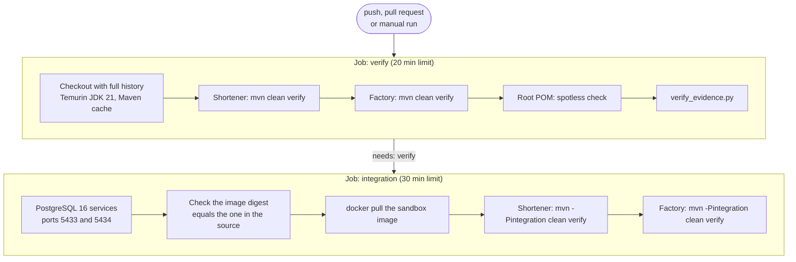

# CI pipeline

**In one paragraph.** One GitHub Actions workflow, [`.github/workflows/verify.yml`](../../.github/workflows/verify.yml), runs on every push, pull request and manual dispatch. The first job runs the full quality gate with unit tests for both modules and checks the recorded evidence. If it passes, the second job repeats the gate with the integration tests against real PostgreSQL service containers and the real Docker sandbox. No job has a model key, and nothing is deployed.

## Flow



*Two jobs in sequence: the fast gate first, then the same gate with databases and Docker.*

## Jobs

| Job | Steps | Proves |
| --- | --- | --- |
| `verify` | Quality gate for the shortener, quality gate for the factory, formatting of the aggregator POM, checksum check of `docs/evaluation/samples/` | The code compiles, unit tests pass, formatting, PMD, SpotBugs, coverage floors and enforcer rules hold, and recorded evidence is unchanged |
| `integration` | Same gate with `-Pintegration`, against two `postgres:16-alpine` service containers and the pinned Maven image | SQL, migrations, locks, the HTTP servers and the Docker sandbox work together |

## Details that matter

| Detail | Why |
| --- | --- |
| `QUALITY_FAIL_ON_VIOLATION: 'true'` | Passed to Maven as `-Dquality.failOnViolation`. PMD and SpotBugs findings fail the build, the same as locally. |
| `fetch-depth: 0` | Factory tests create Git worktrees from scenario baseline tags, so the full history and tags must be present. |
| Shortener integration runs before factory integration | It fills `~/.m2` with the shortener's dependencies. The sandbox mounts that repository read-only and builds offline. |
| The digest check (`grep` for `VALIDATOR_IMAGE` in `factory/src/main/java`) | The workflow and `SandboxValidator.IMAGE` must name the same image, or CI would test with a different sandbox than production uses. |
| `permissions: contents: read`, `persist-credentials: false` | The workflow can read the repository and nothing else. |
| Actions pinned by commit SHA | A moved tag cannot change what runs. |
| `concurrency` with `cancel-in-progress` | A newer push to the same ref cancels the older run. |
| No `ANTHROPIC_API_KEY` | Not configured in CI, and the factory's test JVM blanks it anyway. |

## Reproduce a CI run locally

```sh
export JAVA_HOME=$(/usr/libexec/java_home -v 21)   # macOS; any JDK 21 to 25 works

# Job: verify
mvn -B -f shortener/pom.xml clean verify
mvn -B -f factory/pom.xml clean verify
mvn -B --non-recursive spotless:check
python3 scripts/checks/verify_evidence.py

# Job: integration
docker-compose up -d shortener-db control-db
docker pull maven@sha256:99e61abcff91a9b1333463bd8451fb18495d6eba9250ac66a338b518f8278320
mvn -B -f shortener/pom.xml -Pintegration clean verify
mvn -B -f factory/pom.xml -Pintegration clean verify
```

## What CI does not do

- It does not run the Python smoke scripts, the scenario replays (`agent_smoke.py`) or the browser check. The factory's integration tests cover the same engine paths with fixtures.
- It does not run any live model call.
- It does not build images, publish artifacts or deploy.
- It runs on one JDK (21) and one operating system (Ubuntu).

Whether the workflow has run on a hosted runner depends on the repository having a remote; this documentation makes no claim about past hosted runs. The numbers in the [scorecard](scorecard.md) come from local runs of the commands above.

The verify job also runs `python3 -m unittest discover -s scripts/checks/tests`: missing/empty/skipped evaluation suites cannot report success, and the product launcher must strip control-plane and provider credentials. Browser suites remain local opt-in checks.
