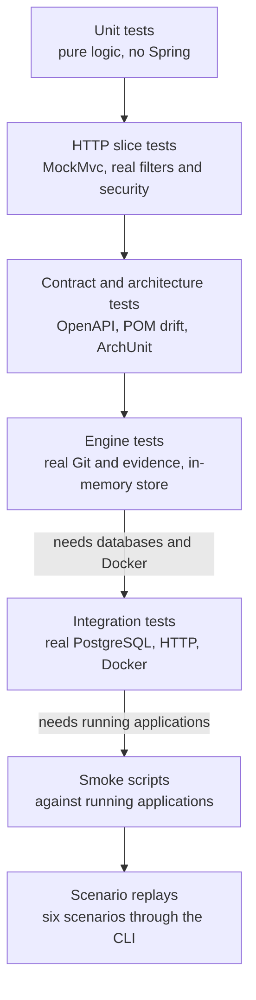

# Testing strategy

**In one paragraph.** Tests are layered by what they need. `mvn test` runs everything that needs nothing but a JDK and Git: unit tests, HTTP tests over a mocked servlet layer, contract and architecture tests, and engine tests that use real Git worktrees and real evidence files. `mvn -Pintegration test` adds the tests that need the two PostgreSQL databases and Docker. Python scripts then check running applications from the outside and replay the recorded scenarios end to end. No automated test calls a paid model.

## The layers



*Each layer needs more of the real environment than the one before it; the first four run in `mvn test`.*

## What each kind proves

| Kind | Proves | Examples | Needs |
| --- | --- | --- | --- |
| Unit | A rule is right for every input class | `UrlPolicyTest` (52 cases), `CreationRateLimiterTest`, `LinkCacheTest`, `CoalescingVisitRecorderTest`, `PatchPolicyTest` (35), `PatchScopeTest`, `TaskGraphTest`, `AuditChainTest`, `GeneratedTestPolicyTest`, `CliCommandTest` | JDK |
| HTTP slice | Status codes, headers, error bodies, filters and the security chain behave as documented | Shortener: classes extending `WebSliceTest` (real controllers, use cases, error mapping, filters, limiter; only storage, visit recorder and stats reader are mocked). Factory: `FactoryControllerTest`, `LocalOperatorFilterTest`, `RequestBodyLimitTest` | JDK |
| Contract | The code and a written contract cannot drift apart | `OpenApiContractTest`: requests and responses of the real MVC stack match `openapi.yaml`, and every endpoint is documented. `ShortenerValidationPomDriftTest`: the sandbox POM mirrors `shortener/pom.xml`. | JDK |
| Architecture | Package dependencies point the allowed way and have no cycles | `StoryArchitectureTest` (factory), `PackageDependencyTest` (shortener) | JDK |
| Engine behaviour | The run engine makes the right decision in each situation: retries, exhausted budgets, stale and changed approvals, parallel branches, tampered evidence, recovery after interruption, revision | `RunEngineApprovalTest`, `RunEngineBehaviorTest`, `RunEngineGenerationTest`, `RunEngineValidationTest`. They use real Git candidates and real evidence files with an in-memory `RunStore` and a scripted validator. | JDK, Git |
| Provider protocol | The Claude adapter and the tool loop speak the provider protocol correctly, within budgets | `ThinkingAwareClaudeTest`, `AgentToolLoopTest`, through a real ADK runner against a local fake HTTP provider | JDK |
| Integration (`@Tag("integration")`) | The real adapters work: SQL, constraints, transactions, locks, migrations, HTTP server, Docker sandbox | See the table below | Databases, Docker |
| Smoke | A running application behaves correctly from the outside | `acceptance.py`, `web_smoke.py`, `browser_smoke.cjs` | Running applications |
| Scenario replay | The whole workflow reaches the expected final state with a valid audit chain | `agent_smoke.py` | Control database, Docker, Maven cache |

### Integration tests

| Test | What it exercises |
| --- | --- |
| `PostgresHttpIntegrationTest` (shortener, 18) | The real application on a random port against PostgreSQL and Flyway: canonical aliases, exactly one winner for concurrent alias claims, `GET` counted and `HEAD` not, body limits, creation throttled while redirects stay available, readiness, request ids, database constraints |
| `AnalyticsPoolIntegrationTest` (shortener, 1) | The analytics pool inherits the primary pool's statement and lock timeouts |
| `ControlRecordIntegrationTest` (factory, 5) | Adoption of a pre-Flyway schema without rewriting bytes; lease conflicts without leaking pooled sessions; persistent chat budget; stale-writer refusal and state bound to the keyed chain; legacy rows verifiable but no downgrade |
| `RunEngineResilienceTest` (factory, 5) | Altered evidence safe-stops; missing evidence stays inspectable; tampering cannot be approved with the old hash; two concurrent advances cannot both hold a run; a recovered patch re-runs validation |
| `FactoryHttpIntegrationTest` (factory, 7) | The real server on a random port with PostgreSQL, Git candidates and the Docker sandbox: operator boundary, typed errors and security headers, token required for run-changing chat commands, clarification and exact-hash approval, separate patch and release approvals, refusal of tampered evidence |

Each suite creates its own database schema and removes it afterwards. The factory HTTP suite also works in a disposable Git clone under `.runs/http-integration-*`. Existing runs and source files are not modified. Running applications on ports 8000 and 8080 are not needed and are not disturbed.

## How to run

```sh
# Fast: no database, no Docker, no model key
mvn test

# One module
mvn -f shortener/pom.xml test
mvn -f factory/pom.xml test

# Everything, including integration tests
docker-compose up -d shortener-db control-db
docker pull maven@sha256:99e61abcff91a9b1333463bd8451fb18495d6eba9250ac66a338b518f8278320
mvn -q test                      # once, to fill ~/.m2 for the offline sandbox
mvn -Pintegration test

# One integration suite
mvn -f shortener/pom.xml -Pintegration -Dtest=PostgresHttpIntegrationTest test
mvn -f factory/pom.xml -Pintegration -Dtest=FactoryHttpIntegrationTest test
```

Replace `test` with `verify` to add the [quality gate](quality-gate.md).

The factory's test JVM blanks `ANTHROPIC_API_KEY` and `FACTORY_AUDIT_KEY`, so tests cannot call the provider even when your shell has a key. Tests that need an audit key use their own.

Database settings for tests come from environment variables, not `.env`; see the [runbook](../03-operations/runbook.md#tests-and-check-scripts-shell-only).

## Scripts

Run from the repository root. Details per script are in [`scripts/README.md`](../../scripts/README.md).

| Script | Checks | Needs |
| --- | --- | --- |
| `scripts/checks/acceptance.py` | Create, redirect, analytics, alias, conflict, invalid URL and unknown code over real HTTP | Shortener running |
| `scripts/checks/agent_smoke.py` | Replays all six scenarios through the CLI with synthetic approvals: four must reach `COMPLETED`, `policy-violation` must reach `SAFE_STOPPED`, `retry-exhaustion` must reach `FAILED`; every audit chain must verify | Control database, Docker, Maven cache |
| `scripts/checks/web_smoke.py` | Operator API: request protections, clarification, stale hash refused, revision, patch approval, validation evidence, rejection, audit | Factory running, sandbox ready |
| `scripts/checks/browser_smoke.cjs` | The operator page in real Chrome, desktop and mobile | Both applications, Node 22.12+, `puppeteer-core` |
| `scripts/checks/clean_checkout.py` | `mvn clean test` in a fresh clone of the committed `HEAD`, so ignored or uncommitted files cannot hide a problem | JDK, Maven |
| `scripts/checks/verify_evidence.py` | The recorded evidence under `docs/evaluation/samples/` matches its checksum manifest | Python |
| `scripts/checks/evaluate.py` | Runs integration tests, scenario replays, operator controls and product acceptance in order and stores logs and results under `.runs/evaluation/<timestamp>/` | Everything above |
| `scripts/checks/live_tools_smoke.py --live` | All seven agent tools through chat. Makes paid calls. | Factory running with a provider key |

Approvals made by these scripts are labelled `synthetic-fixture-test` or `synthetic-evaluation-test` in the audit events. They show that the mechanism works, not that a person reviewed anything.

## What is not tested

- **Model quality.** Fixture runs replay recorded output. There is no automated live run.
- **Load.** No throughput, latency or soak test exists for either application.
- **More than one instance.** The cache and rate limiter are per process and are only tested that way.
- **The sandbox as a security boundary.** Tests check that the right Docker flags are passed and that results are classified correctly, not that a hostile build cannot escape a container.
- **The browser UI in CI.** `browser_smoke.cjs` is a local, optional check.

Current counts and coverage are in the [scorecard](scorecard.md).

## Assignment readiness checks

The [assignment guide](assignment-readiness.md) maps each criterion to evidence. The evaluator now uses fresh quality-gated integration reports and requires tests in both modules; its own failure-detection checks and the product credential boundary run with `python3 -m unittest discover -s scripts/checks/tests`. `FeatureRequestGovernanceTest` verifies current-commit pinning and the human scope checkpoint. `scripts/checks/adk_chat_smoke.cjs` covers actual ADK Markdown rendering, including the previously failing multiline shortener diagram.
