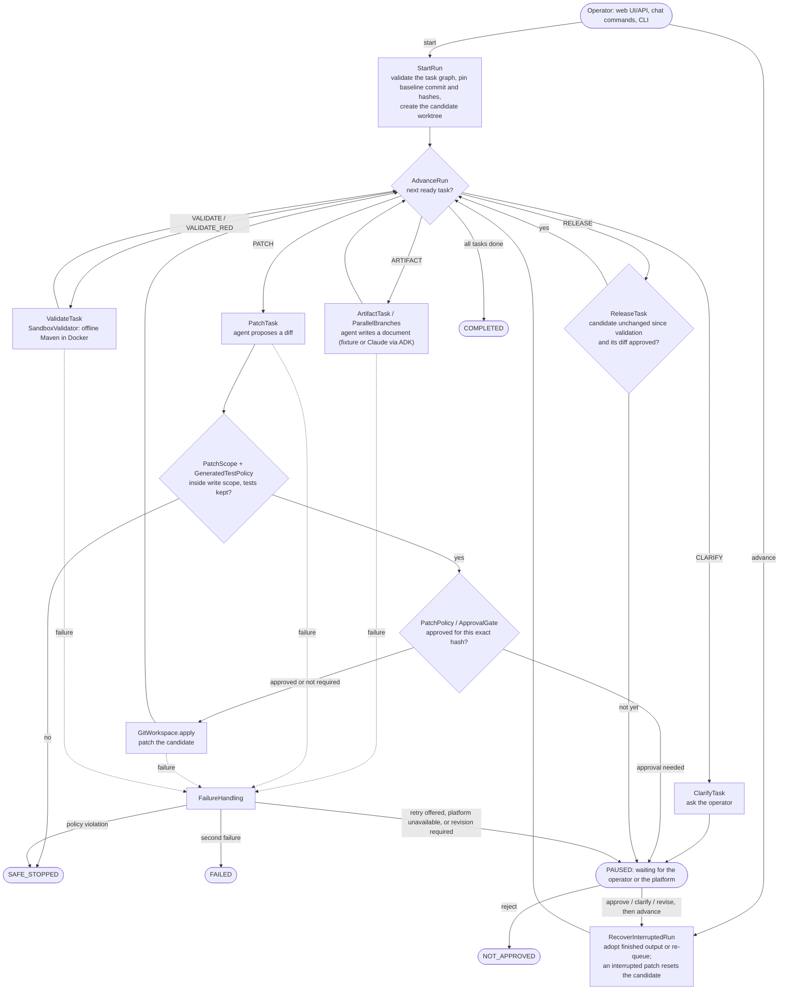
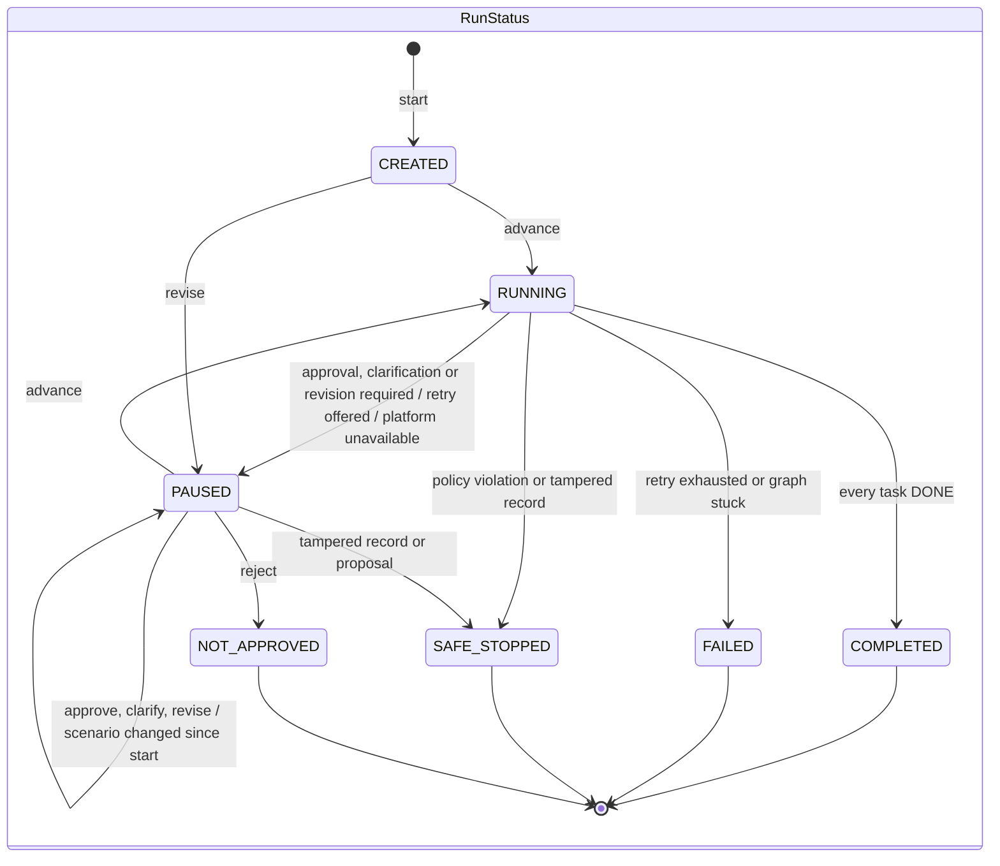
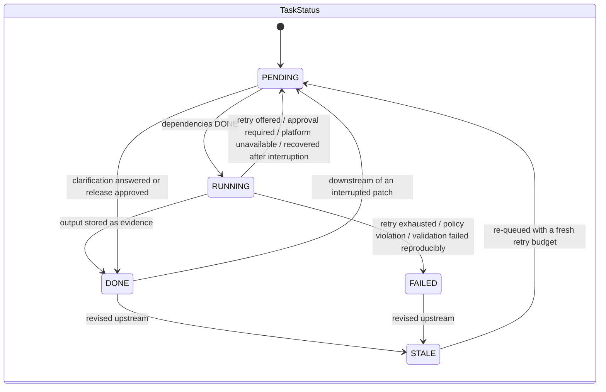

# Software factory

This module takes an engineering request through planning, generated patches, review, sandbox tests and release approval. It operates on isolated candidates; it does not apply generated changes to this checkout.

## The story of a run

An operator submits a **scenario** (a requirement plus a graph of tasks). The **run** engine advances that graph one committed transition at a time: agents **generate** artifacts and patches, patches pass **governance** and land in an isolated **candidate**, a sandbox provides **validation**, humans approve the gated steps, and every transition is written to the **audit** record. The packages under `src/main/java/dev/softwarefactory/` are named after those chapters; read them top-down.



Every arrow that changes state is one `RunStore.record(...)`: the new snapshot and its audit event are committed together before the next action, under the run's lease. Outputs, reviewed proposals and failure diagnostics are immutable files in the `EvidenceStore`.

### Run and task states





How a task failure is classified (`run/FailureHandling`):

| Failure | Outcome | Retry budget |
| --- | --- | --- |
| `SecurityException` (policy violation, exhausted model budget, escaping fixture) | run `SAFE_STOPPED`, task `FAILED` | n/a |
| `InfrastructureException` (Docker, validator image, Maven cache, control database) | run `PAUSED`, task `PENDING` | not consumed |
| `ValidationFailedException` on a validation task | run `PAUSED` with `revisionRequiredTask`; an upstream task must be revised | not consumed |
| anything else | first time: run `PAUSED`, task `PENDING` (retry); second time: run `FAILED` | consumed; reset when the task is revised |

### Packages

Dependencies point down this table only (`operator → run → {generation, validation, candidate, audit, governance, scenario} → platform`); `StoryArchitectureTest` (ArchUnit) fails the build on a violation or a package cycle. Every package has a `package-info.java` saying which chapter it is.

| Package | Chapter | Responsibility and starting point |
| --- | --- | --- |
| `scenario/` | What is asked | `ScenarioSpec`, `TaskSpec`, `TaskKind`, `Stage`; `TaskGraph` validates dependencies and stage order and answers which tasks are ready; `FeatureScenario` is the trusted workflow for a feature request; `ScenarioFiles` reads scenario documents. |
| `run/` | How a run progresses | `RunEngine` is the facade and table of contents. Transitions: `StartRun`, `AdvanceRun` (scheduler loop), `ApproveStep`, `AnswerClarification`, `ReviseRun`, `RecoverInterruptedRun`. One `TaskExecutor` per task kind: `ClarifyTask`, `ArtifactTask`, `PatchTask`, `ValidateTask`, `ReleaseTask`; `ParallelBranches` joins two artifact tasks. Shared policy: `FailureHandling`, `ApprovalGate`, `EvidenceIntegrity`, `RunEvidence`, `CandidateRebuild`. State: `RunState`, `RunStatus`, `TaskStatus`; `RunStore` is the persistence port and `DurableRunStore` its production adapter. |
| `generation/` | Agents produce work | `AgentRuntime` with `FixtureRuntime` (recorded) and `AdkClaudeRuntime` (live, created through `AgentRuntimes`); `PromptBuilder` assembles a task prompt; `SourceContext` and `UntrustedText` bound and delimit repository data. |
| `generation/tools/` | | Read-only agent capabilities: `EngineeringTools` catalog, `RepositoryReader`, `PublicWebReader` (`PublicUrls`, `PublicAddresses`, `HtmlText`), `AnthropicWebSearch`, `WebAccessPolicy`; `ToolSession` enforces per-invocation budgets and audits tool calls. |
| `candidate/` | The isolated working copy | `GitWorkspace` (detached worktree under `.runs/`, patch application, exact candidate diff); `CommandRunner` (bounded host processes). |
| `validation/` | Proving the candidate | `CandidateValidator` port; `SandboxValidator` classifies outcomes, `DockerSandbox` runs offline Maven in a locked-down container, `SurefireReports` reads results; `GeneratedTestPolicy` keeps generated changes from weakening the suite. |
| `governance/` | Rules and human gates | `PatchScope` (worker write authority), `PatchPolicy` (changes that always need approval, including `**/platform/**` and legacy `**/bootstrap/**`), `Hashes` (approval hashing), `PolicyViolationException`. |
| `audit/` | The record | `RunJournal` (state snapshots, written together with their audit event), `AuditTrail` + `AuditChain` + `AuditKey` (keyed hash chain and its verification), `RunLeases`, `ChatLedger`, `ControlDatabase`, `EvidenceStore`, `RunMetrics`, `EventTypes`. Stores runs as opaque JSON, so it does not depend on `run`. |
| `operator/api/` | How humans drive it | `FactoryController` (HTTP routes and error mapping), `FactoryService` (actions), `RunWorkers` (background advancing), `RunViews` / `RunDetail` / `MetricsSummary` (what the operator sees). |
| `operator/chat/` | | `FactoryAgent` (ADK entry point), `OperatorCommands` (literal slash commands), `ChatConversation` (read-only answers). |
| `operator/security/` | | `LocalOperatorFilter`, `OperatorToken`, `RequestBodyLimit`. |
| `operator/cli/` | | `FactoryCli` (process wiring), `CliCommand` (argument parsing), `CliActions` (what each command does). |
| `operator/web/` | | `FactoryWebServer` (Spring composition root) and `FactoryWebConfiguration` (security chain). |
| `platform/` | Cross-cutting | `FactorySettings`, `Json`, `InfrastructureException`, `WorkflowConflictException`, `WorkspaceRoot`, `LogText`, `LruMap`. |

The browser files live together in `src/main/resources/static/factory/`. Tests mirror the Java packages under `src/test/java/dev/softwarefactory/`. `RunEngine` takes its collaborators (run store, evidence store, workspace, validator, agent runtimes, clock) through its constructor, so the `run` tests exercise the whole workflow with real Git and evidence files but without Docker, a database or a provider.

From the repository root, run `python3 scripts/factory_web.py`. See the [operator guide](../docs/operations/operator-guide.md) and [agent architecture](../docs/architecture/agent-system.md).

## Quality gate

`mvn -f factory/pom.xml verify` runs Spotless, PMD, SpotBugs/FindSecBugs, the enforcer rules and a JaCoCo line-coverage floor of 0.70 over the unit tests; any finding fails the build. `mvn -f factory/pom.xml -Pintegration verify` adds the tests that need the control database and Docker.

## Spring runtime

The web application has an explicit Spring Boot composition root in `operator/web/FactoryWebServer.java`. Spring owns the service lifecycle, ADK loader, control connection pool, migrations, security chain and health endpoints. See [platform decisions](../docs/architecture/spring-platform.md) for library choices and the local-only operator boundary.

## Configuration and maintenance

All environment settings are read once by `platform/FactorySettings`. Live runs need `ANTHROPIC_API_KEY` and `FACTORY_AUDIT_KEY` (at least 32 characters); the audit key signs the audit chain (HMAC-SHA256) and is kept outside the control database. Without it, fixture runs use a development key generated in `.runs/audit.key`. Rows written before this scheme keep verifying with their recorded `hash_scheme`.

Workflow commands in ADK chat (`/feature`, `/demo`, `/advance`, `/approve`, `/reject`, `/answer`, `/changes`) require the operator token; use the operator page for decisions.

`python3 scripts/factory_cli.py prune [--days N]` lists candidate worktrees and evidence of terminal runs older than N days (default 30); add `--apply` to delete them. Database state and audit rows are kept.

## HTTP integration tests

`operator/web/FactoryHttpIntegrationTest` uses REST Assured against a real Spring Boot server on a random port. It exercises MVC, security, the factory service, asynchronous orchestration, PostgreSQL audit/state persistence, Git candidates and actual Docker validation. Recorded fixtures replace only model generation; no approval, persistence or validator is mocked.

The suite checks operator-token/origin restrictions, request validation, ADK agent registration, clarification, stale approval hashes, revision and rejection, evidence tampering, and separate patch/release approvals. The happy path reaches completion only after candidate tests pass. Every run asserts zero model calls and a valid audit chain. Surefire clears `ANTHROPIC_API_KEY` in its test JVM, and the suite verifies that live mode is unavailable.

From the repository root, with JDK 21, Git, Docker/Colima and the control database running:

```sh
mvn -pl factory -Pintegration -Dtest=FactoryHttpIntegrationTest test
```

The test owns a unique database schema and a disposable Git clone under `.runs/http-integration-*`; it copies current scenario files into that clone. Background workers drain before cleanup removes these resources. Existing operator runs and source files are not modified. `CONTROL_DB_URL`, `CONTROL_DB_USER`, and `CONTROL_DB_PASSWORD` override local Compose defaults; Maven does not load `.env`. Port 8000 need not be running.

The Docker validator requires the pinned Maven image and populated local Maven cache described in the [root test instructions](../README.md#rest-assured-integration-tests). These tests exercise orchestration and boundaries, not live model reasoning quality. `RunEngineResilienceTest` and `ControlRecordIntegrationTest` additionally cover recovery, concurrent leases, migration compatibility and persisted budgets.
