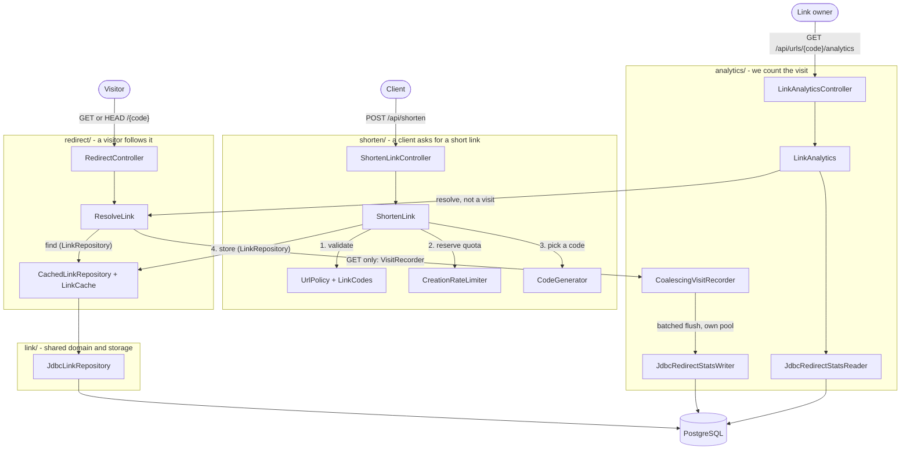

# URL shortener

The Spring Boot product built and tested by the software factory. Its public contract is [openapi.yaml](openapi.yaml).

## The story of a link

Read `src/main/java/dev/shortener/` top-down as the journey of a link: a client asks for a short link (`shorten/`), a visitor follows it (`redirect/`), and the visit is counted (`analytics/`).



| Package | Responsibility | May depend on |
| --- | --- | --- |
| `shorten/` | `POST /api/shorten`. `ShortenLink` validates the target (`UrlPolicy`) and alias, reserves creation quota (`CreationRateLimiter`), picks a code (`CodeGenerator`) and stores the link. | `link`, `platform` |
| `redirect/` | `GET`/`HEAD /{code}`. `ResolveLink` turns any spelling of a code into its link and hands each followed link to a `VisitRecorder`; `CachedLinkRepository` and `LinkCache` keep lookups fast and available in front of PostgreSQL. | `link`, `platform` |
| `analytics/` | `CoalescingVisitRecorder` counts visits in memory and flushes them in batches over a dedicated pool (`AnalyticsConfiguration`); `LinkAnalytics` serves `GET /api/urls/{code}/analytics`. | `redirect`, `link`, `platform` |
| `link/` | The shared domain: `Link`, the code rules (`LinkCodes`) and storage (`LinkRepository`, `JdbcLinkRepository`). | nothing |
| `platform/` | Not part of the story: `ShortenerProperties` and the shared clock, `platform/security` (`PublicApiSecurity`), `platform/http` (`ApiErrors` problem responses, `RequestBodyLimit`, `RequestCorrelation`). | nothing |

`ShortenerApplication` stays at the package root so Spring scans every package. Each package has a `package-info.java` stating its part of the story, and `PackageDependencyTest` (ArchUnit) enforces the dependency column and the absence of cycles.

Conventions:

- Types are package-private unless another package needs them. Use cases (`ShortenLink`, `ResolveLink`, `LinkAnalytics`) are `@Service` classes; a package's `*Configuration` builds only the collaborators that need settings.
- A story reports a failure by throwing a subclass of `platform.http.ApiException`, which names its own HTTP status. `ApiErrors` turns it into a problem document without knowing any story.
- The cache is invisible to the stories: every package reads and writes links through `LinkRepository`, and `redirect/` makes the cached implementation the primary bean.

Historical scenario baselines and exported evaluation evidence retain their original paths (`links/`, `ShortenerService`, ...); replay them against their pinned commits.

Schema migrations are in `src/main/resources/db/migration/`; runtime configuration is in `src/main/resources/application.yml`. Tests mirror production packages under `src/test/java/dev/shortener/`. HTTP-level tests extend `WebSliceTest`, which runs the real controllers, use cases, error mapping, filters and security chain over MockMvc and mocks only link storage, the visit recorder and the statistics reader.

From the repository root, start the database with `docker-compose up -d shortener-db`, then run `python3 scripts/shortener.py` (loads local database settings from `.env`) with JDK 21. Validate the running service with `python3 scripts/checks/acceptance.py`.

## REST Assured integration tests

`PostgresHttpIntegrationTest` starts the real Boot application on a random port and exercises HTTP against PostgreSQL and Flyway. It covers canonical aliases, concurrent alias conflicts, HEAD versus GET analytics, invalid/private targets, body limits, throttling, redirect availability and readiness. `analytics/AnalyticsPoolIntegrationTest` checks that the analytics pool inherits the primary pool's statement and lock timeouts. Redirect following is disabled so tests never visit target URLs. Awaitility waits for asynchronous analytics with a bounded deadline.

From the repository root, with JDK 21 and the shortener database running:

```sh
mvn -pl shortener -Pintegration -Dtest=PostgresHttpIntegrationTest test
```

Each test gets a fresh application context so cache and rate-limiter state cannot leak between cases. Each suite creates a unique PostgreSQL schema (`PostgresSchema`) and drops it afterward. Configure `SHORTENER_TEST_DB_URL`, `SHORTENER_TEST_DB_USER`, and `SHORTENER_TEST_DB_PASSWORD` if needed; these fall back to `SHORTENER_DB_*` and then the local Compose defaults. Maven does not load `.env` automatically. No server on port 8080 is required.
